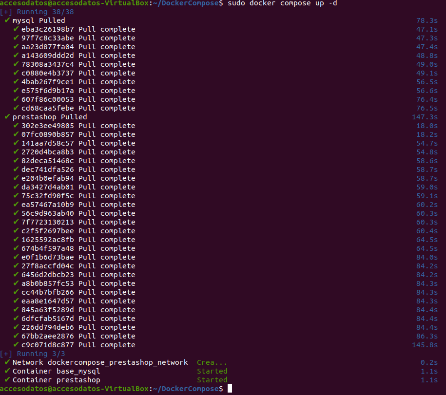
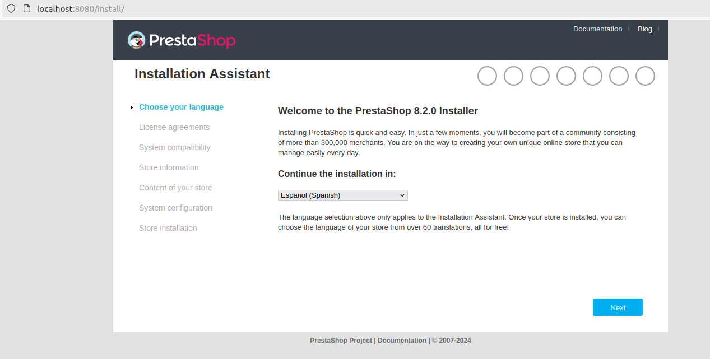
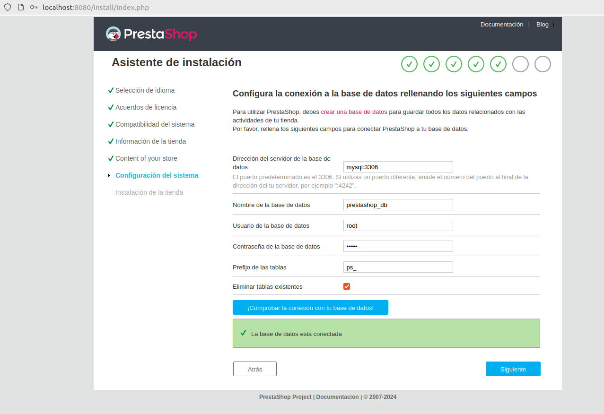
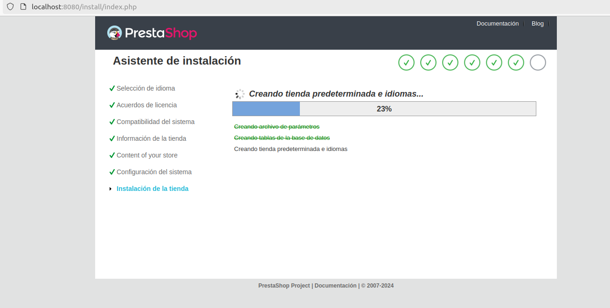
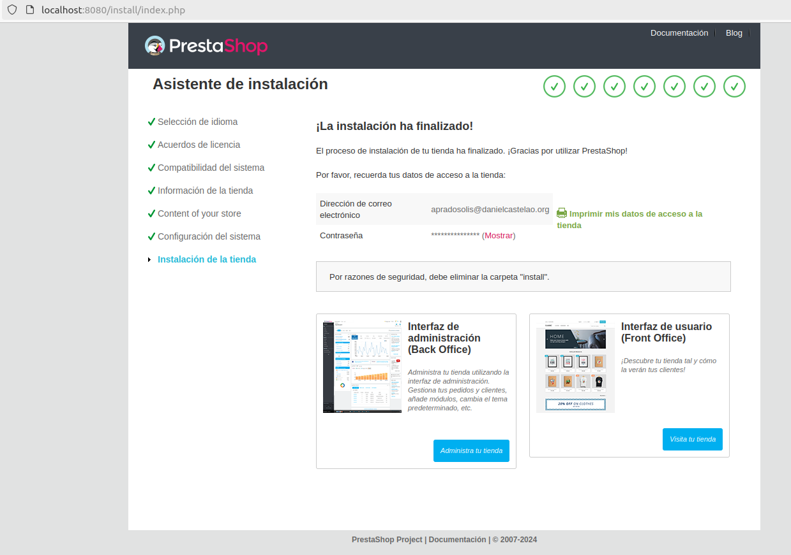

# Docker_05

1. Creación del archivo DockerFile

  Para crear el archivo escribimos lo siguiente:
  ```bash
  nano docker-compose.yaml
  ```
  Ahora mismo estamos dentro, con esto podremos crear los contenedores, las conexiones con la base de datos y la cconfiguracion de PrestaShop

  ```bash
services:
   mysql:
     image: mysql:latest # Descargamos la imagen mas reciente
     container_name: base_mysql
     restart: always
     environment:
       MYSQL_DATABASE: prestashop_db   # Nombre de la base de datos
       MYSQL_ROOT_PASSWORD: admin      # Contraseña para el superusuario
     networks:
       - prestashop_network   # Red creada para su uso       
   prestashop:
     image: prestashop/prestashop:latest 
     container_name: prestashop
     restart: always
     depends_on:
       - mysql 
     ports:
       - 8080:80    # Puerto utilizado 
     environment:
       DB_SERVER: mysql   # Nombre de la base de datos
       DB_NAME: prestashop_db  # Nombre base de datos
       DB_USER: root   # Nombre del usuario mysql
       DB_PASSWD: admin  # Contraseña mysql
     networks:
       - prestashop_network  # Mista red que mysql
networks:
     prestashop_network
  ``` 
  Ahora tenemos que guardar el archivo, despues tenemos que ejecutar un comando dentro de ese directorio:
  ```bash
    sudo docker compose up -d
 ``` 


2. Configuracion Pagina
   
Si todo salio bien aparecera esto:



Tendremos que configurar todos los puntos que aparece hasta el de la conexion con la base de datos: el puerto predeterminado de mySQL es 3306



Con todo correcto, se finalizara la isntalacion:





3. Arreglo

Al intertar acceder a Administar Tienda dará error:

Para arreglar esto necesitamos eliminar la carpeta install:
```bash
sudo docker exec -it prestashop rm -rf /var/www/html/install
```
Por último cambiamos el nombre de la carpeta admin:
```bash
docker exec -it prestashop mv /var/www/html/admin /var/www/html/admin552vw8sb9uvj8ucjobz
```
En el navegador escribimos lo siguiente:
```bash
http://localhost:8080/admin552vw8sb9uvj8ucjobz
```
Esto nos llevara a la pagina PrestaShop, la cual nos pedira nuestro nombre de usuario y contraseña:

Iniciamos sesion y ya podriamos administrar nuestra tienda de Prestashop
